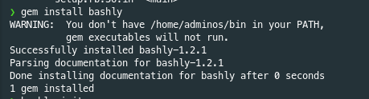

Ok this tutorial show to create a script to use rclone using command line and bash verification path and mount

First step create a command with bashly

**[bashly getting started](https://bashly.dannyb.co/usage/getting-started/)**

For this project we call it rclonerem

```bash
mkdir rclonerem
bashly init
```

# Installation

 

en mi caso tuve que agregar el path solicitado al path de linux

```bash
export PATH=$PATH:/home/adminos/go/bin:/home/adminos/go/bin:/home/adminos/.cargo/bin:/usr/local/bin:/usr/local/sbin:/usr/bin:/usr/sbin:/var/lib/snapd/snap/bin:/home/adminos/bin
```


# Anadiendo un comando

Primero tenemos que irnos a la definicion de ello en el archivo src/bashly.yml


